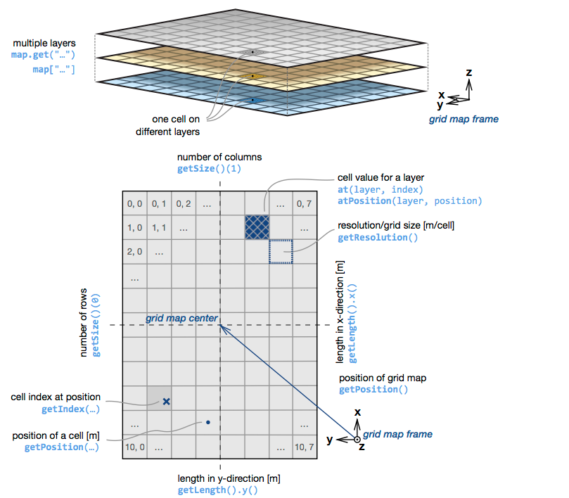
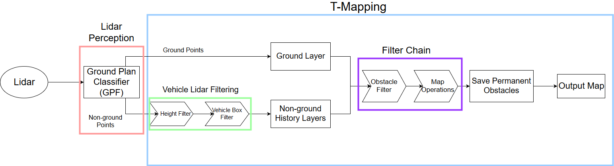
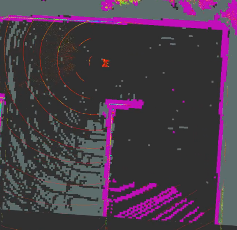
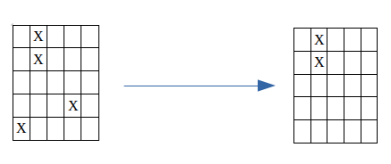
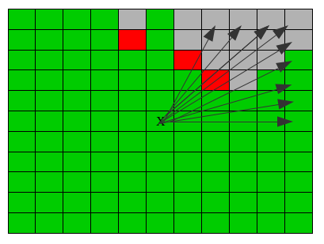
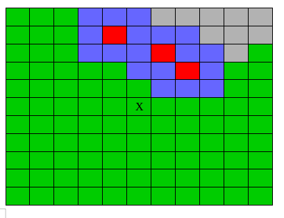

# MITRE Layered Map
 This package contains a high-speed lidar and gridmap based mapping solution for unstructured environments and an editable "static map" for use in recording obstacles over large distances. The package is intended for use in autonomous vehicle operations since it can perform on a large scale (several hundred meters), at moderate to high resolution (0.3-1m cell width), and at a high frequency (>10hz).
 
 
 The sensor mapping solution takes a point cloud segmented into ground and nonground points as input. This is currently done externally by the [LidarPerception Library](https://github.com/LidarPerception). Internally, the mapping solution uses the [GridMap](https://github.com/ANYbotics/grid_map) package for data storage and configurable [Filter Chains](http://wiki.ros.org/filters) to process the data. Finally, the map outputs a costmap and the gridmap.

 The editable "static" map can take a static map from the map server, a gridmap, or a marker message as input. It will use each of these to record obstacles on a large scale. 


## Quick Start

Below is a guide to get up and running with this package quickly.

### Dependencies

We assume that you already have installed ros. This package is specifically for ros kinetic. It may work with others, but has not been thorougly tested. Below are several packages that you may not have installed by default:

- [Eigen](http://eigen.tuxfamily.org/index.php?title=Main_Page)

```bash
sudo apt-get install libeigen3-dev
```

- [GridMap](https://github.com/ANYbotics/grid_map)

```bash
sudo apt-get install ros-kinetic-grid-map
```

- [Point Cloud Library (PCL)](http://pointclouds.org/downloads/linux.html)

```bash
# For Ubuntu only, installation for other distros may vary
sudo add-apt-repository ppa:v-launchpad-jochen-sprickerhof-de/pcl
sudo apt-get update
sudo apt-get install libpcl-all
```

- [TF2 Sensor Msgs](http://wiki.ros.org/tf2_sensor_msgs)
```bash
sudo apt-get install ros-kinetic-tf2-sensor-msgs
```

### Building

You should now have all of the packages required to build. You can build by running:

```bash
catkin build mitre_fast_layered_map -DCMAKE_BUILD_TYPE=Release
```

You do not need to always build in release mode, but GridMap and Eigen suggest it for matrix optimization. We have generally seen >100% increase in speed in building release vs standard.

### Running

The easiest way to run the package will be to use the **local_map.launch** file located in the *launch* directory. You should modify the configuration to fit the *topics* and *tf-frames* that you are currently using. 

Our current approach using the GPF segmenter launched from the [LidarPerception Library](https://github.com/LidarPerception). 

```bash
# In first terminal window
roslaunch lidar_perception lidar_segmenter.launch

# Second terminal window
roslaunch mitre_fast_layered_map run_maps.launch
```

The first command will start up the lidar segmentation node, which will output the topics ingested by the mapping node. The second roslaunch will start both our horizon and local mapping systems, which are detailed below.

## ROS API

This package currently contains 2 different mapping solutions. One, which is shown in the quickstart section is a sensor map that relies on lidar data to populate cells as obstacles. Secondly, is an editible static map that is populated from the map server instance, gridmap, or marker messages. 

You can see full configuration setups for each by viewing the files: `/launch/local_map.launch`, `/config/local_map.yaml`, and `config/filter_chain.yaml` for the sensor map, and the files: `/launch/static_map.launch` and `/config/static_map.yaml` for static mapping.

### Published Topics

- `/map_name/costmap`([nav_msgs/OccupancyGrid](http://docs.ros.org/melodic/api/nav_msgs/html/msg/OccupancyGrid.html)) - Contains cost map calculated from various grid map layers
- `/map_name/gridmap`([grid_map_msgs/GridMap](https://github.com/ANYbotics/grid_map/blob/master/grid_map_msgs/msg/GridMap.msg)) - Contains the full grid map. This may be large depending on the the configurations options for the map. 

Both the sensor map and static map output the same topics where `map_name` is a configurable map name and is `Map` by default. 

### Subscribed Topics

#### Sensor Map

- `ground_points`([sensor_msgs/PointCloud2](http://docs.ros.org/melodic/api/sensor_msgs/html/msg/PointCloud2.html)) - Lidar points hitting the ground plane.
- `nonground_points`([sensor_msgs/PointCloud2](http://docs.ros.org/melodic/api/sensor_msgs/html/msg/PointCloud2.html)) - Lidar points that are nonground, generally assumed to be obstacles.
- `odometry`([nav_msgs/Odometry](http://docs.ros.org/melodic/api/nav_msgs/html/msg/Odometry.html)) - The odometry for the vehicle. The map will follow the vehicle so that the vehicle is always in the center.
- `static_map`([nav_msgs/OccupancyGrid](http://docs.ros.org/melodic/api/nav_msgs/html/msg/OccupancyGrid.html)) - Optional. A geo-referenced map that holds apriori obstacle data for reference with the map. 
- `marker`([visualization_msgs/Marker](http://docs.ros.org/melodic/api/visualization_msgs/html/msg/Marker.html)) - Optional. Markers can be passed to the map to create obstacles. 

#### Static Map

- `static_map`([nav_msgs/OccupancyGrid](http://docs.ros.org/melodic/api/nav_msgs/html/msg/OccupancyGrid.html)) - A geo-referenced map that holds apriori obstacle data for reference with the map. 
- `gridmap`([grid_map_msgs/GridMap](https://github.com/ANYbotics/grid_map/blob/master/grid_map_msgs/msg/GridMap.msg)) - Uses the grid map as input to get add additional obstacles to the static map.
- `marker`([visualization_msgs/Marker](http://docs.ros.org/melodic/api/visualization_msgs/html/msg/Marker.html)) - Optional. Markers can be passed to the map to create obstacles. 


### Configuration

Below is a list of configuration options available for use, along with short descriptions of their use.

#### Sensor Map Configuration

| Name | Type | Required | Default | Notes |
| ---- | ---- | -------- | ------- | ----- |
| map_name | string | no | "map" | Name used to refer to the mapping instance. Useful for debugging when running multiple map instances simultaneously. |
| odom_sub_topic | string | yes | None | Topic to receive and update map position (nav_msgs/Odometry). The map will center on the odom position. |
| ground_points_sub_topic | string | yes | None | Topic used to receive lidar points (sensor_msgs/PointCloud2) classified as part of the ground plane. |
| nonground_points_sub_topic | string | yes | None | Topic used to receive lidar points (sensor_msgs/PointCloud2) classified as nonground (e.g. obstacle) |
| map_frame_id | string | yes | None | Frame for the map to operate in. Common settings might be "odom" or "map". |
| vehicle_frame_id | string | yes | None | Frame attached to the vehicle. |
| map_len | float | yes | None | Length in meters of the map. Reminder that the vehice is in the middle of the map, so a setting of **50** will give 25 meters on every side of the car. |
| resolution | float | yes | None | Length of the side of each cell in meters. **Attention**: Carefully consider the tradeoff of map_len and resolution. A larger map_len and higher cell resolution will increase memory and computation demands. |
| filter_ns | string | yes | None |Defines the filters that will be used to process the map after lidar points are received. |
| entropy | int | no | 5 | Defines how quicly map obstacles are cleared. E.g., a value of 5 means an obstacle will be cleared after 5 iterations of no nonground point hits. |
| enable_height_point_filtering | bool | no | false | Filter points based on height. Used to remove obstacle points that may occur as a result of overhanging trees or bridges. |
| max_point_height | float | no | -1 | If height filtering is enabled, this setting determines the threshold for points to be removed. | 
| footprint_len_m | float | no | 4 | Base footprint length of the robot. |
| footprint_width_m | float | no | 2 | Base footprint width of the robot. Lidar points within the base will be removed. |
| static_map_sub_topic | string | no | None | Receives **nav_msgs/OccupancyGrid**.Map will cross reference with a static map and add any obstacle in the static map to its own map. |
| marker_sub_topic | string | no | None | (Limited Support) Receives **visualization_msgs/Marker**. Map will add a circle obstacle of radius marker.scale.x to the map at the given position. |

#### Static Map Configuration

| Name | Type | Required | Default | Notes |
| ---- | ---- | -------- | ------- | ----- |
| map_name | string | no | "map" | Name to refer to the map by in debug messages. |
| static_map_sub_topic | string | yes | None | Static map acting as starting state. Commonly provided through ros map_server. |
| marker_sub_topic | string | no | None | (Limited Support) Receives **visualization_msgs/Marker**. Map will add a circle obstacle of radius marker.scale.x to the map at the given position. |
| gridmap_sub_topic | string | no | None | Receives **grid_map_msgs/GridMap**. Adds obstacles from the gridmap as permanent obstacles. |
| grid_map_layer | string | no | "permanent" | If subscribed to gridmap, the layer to use to get the permanent obstacles. |

### Provided Launch Files

- `local_map` - Starts a map in the odom frame with low map_len, but high resolution. 
- `horizon_map` - Starts a map instance in the odom frame with high map_len, but lower resolution.
- `run_maps` - Launches the local and horizon maps.
- `static_map` - Launches a static map instance. The map inherits size and frame from the static map it receives.
- `debug_mitre_fast_layered_map` (Developer Only) - Launches the local_map instance in gdb. Note, you must have compiled with `-DCMAKE_BUILD-TYPE=Debug` prior to launching.
- `profile_mitre_fast_layered_map`(Developer Only) - Launches the local_map instance with valgrind to record performance.

Depending on your needs, it is common to run using a local map for short range mapping. Due to its high resolution, it can best be used for reflexive behaviors such as obstacle avoidance or short term path or motion planning. A horizon map configuration uses a covers a larger area but with lower resolution. It is best used for longer term behaviors and path planning. Finally, the static map can be integrated with either map to permanently save obstacles. Since this map is not subject to CPU intensive tasks, it can be quite large (>1km) and experience no significant problems. This may be used in cases where long term recorded history is required due to map scrolling issues with the two previous maps (e.g., obstacles roll out of site of the map, so path planning no longer considers them).


## Grid Map Background

For each of our maps, we use the [GridMap](https://github.com/ANYbotics/grid_map) library to store obstacles and keep relative position. Please view the GridMap page for a detailed overview, but we have added the image below from their github as a an overview of how the data is organized.



In brief, GridMap has a layered "rolling" grid structure.

In this case, layered means that each cell is able to record various types of data about itself, which is then held in the seperate layers of the GridMap. For example we record the number of ground and nonground points in a cell, but the data for each is kept in a seperate layer. Below we discuss what layers we store, and what information lives in each layer. 
    
The "rolling" of the grid indicates that as the grid moves, cells are not deleted, but are rather "rolled" to the opposite side of the grid. For instance, when moving forward, the cells at the very edge of the back will be moved to the front once they are out of scope. 


Please be aware of the following side effects of GridMap, which could cause subtle errors.
1. Due to the "rolling grid" the map can only move discretely in increments of the cell resolution. Therefore, if the vehicle were to move less than the cell resolution, the grid would not move and the vehicle might be slightly off center of the grid.
2. As shown from the image, a cells position is the center of the cell and is **not** attached to any of the corners.
3. As shown in the image, by default GridMap uses the ROS FLU coordinate standard.
4. Our mapping system only interacts with GridMap. The occupancy grid that we output is created by a conversion function provided by GridMap that turns a single layer into an occupancy grid. It should follow all ROS standards for occupancy grids.

## Sensor Map

We first give a general overview of the pipeline that is used to turn lidar point clouds and odometry readings into a full map. 


The pipeline begins with our lidar sensor or sensor(s) that output a point cloud. The point cloud is then fed into GPF which is our current ground segmentation solution. It will classify each point in the point cloud as either belonging to the ground plane or not, and then publish topics with a *ground* and *non-ground* point cloud holding those points. Our mapping solution then ingests the The ground segmenter outputs two clouds: one made of only ground points and one of only non-ground points. We ingest these topics into our mapping solution. In the first stage, we do some basic point filtering, such as height filtering to remove points that are significantly above the height of the car or bounding box filtering to remove points that are hitting the car. We then store the point cloud data in GridMap for use later. Currently, ground points are only stored for a single frame, but nonground points can be stored for a longer (configurable) time. 

After all of the sensor data has been received, we then pass the GridMap to our [FilterChain](http://wiki.ros.org/filters) which runs additional stateless filtering algorithms. We currently use two filter chains, one for obstacle detection and on for map operations. The obstacle detection filter chain (by default) contains a bayes filter and a threshold filter. The bayes filter determines the liklihood of each cell being an obstacle based on the sensor readings and the threshold layer outputs all cells above a given threshold as obstacles. The map operations filter chain then assumes that all obstacles have been placed on the map and is used for operations like inflation and ray-tracing. Inflation will "inflate" obstacles to be larger than they are and ray tracing is used for ground clearance and determining cells with unknown information. 

The results from this process are then finally output as a costmap.

### Lidar Segmentation

The basis of our entire mapping solution is that we can classify points as *ground* (i.e., we can can drive on it) and *non-ground* (i.e., we probably don't want to drive on it). We have tried several open source segmentation algorithms and have found the GPF segmenter from the [Lidar Perception Github](https://github.com/LidarPerception/segmenters_lib) to work the best for our needs. We give a short overview of the GPF algorithm below to better help users understand its possible failure modes.

At its core, GPF is the RANSAC algorithm with the additional hueristic that the lowest recorded point must be part of the ground plane. For those unfamiliar, RANSAC (Random Sample Consensus) is an randomized algorithm for determining parameters for a given mathematical model. A common example is to determine lines of best fit on a scatter plot by randomly picking 2 points in the plot, determining their parameters (line slope and y-intercept) and then calculating the least squares error to determine how well the randomly selected points/parameters fit the rest of the data. 

In our case, we are trying to model a plane, so GPF may be parameterizing by a normal vector and point on the plane. While the RANSAC algorithm randomly picks points, GPF uses the hueristic that the lowest point is part of the ground, thus giving a better starting point to start fitting our plane and eliminates any attempts where the point may be in the air. Generally, we have found this to be a decent hueristic, but it does have one failure case we are aware of. Below is an image of the very early days of our mapping solution.



This image was from the top of a parking garage. As you can see, there are a lot of points in the lower right corner being classified as *non-ground* and thus the map is showing them as obstacles. We determined the problem was lidar points were hitting the parking garage level below ours, causing GPF to consider that the ground plane (since the lowest points are down there), even if they were quite sparse due to other obstacles. 

To its credit, the GPF solution does have the ability to fit multiple ground planes to different regions (e.g., one behind, one centered on us, and one out front), so the failure of that one ground plane does not end up affecting our immediate plans drastically, but regardless, it is still giving us poor information.

### Sensor Map GridMap Implementation

We currently have seven different layers: ground, nonground, permanent, entropy, elevation_min, found_obstacle, in_a_row and occupancy. We expect this list to continue growing as we begin adding more data such as height for each cell. We also have a list of specific numeric values that determine how we classify each cell.

#### Layer Values

- Clear - 0
- Nonground - 100
- Inflation - 30
- Unknown - 20

#### Ground Layer

The ground layer is primarily the storage layer for the lidar points that have been classified as ground points, but is also currently responsible for holding unknown cells. In our usual pipeline, the ground layer will be updated as follows:

1. Receive lidar points classified as ground. 
2. For cells that received ground points, check if there are also nonground points that have registered in this cell. If so, we check to see how long it has been since the last nonground point registered and may clear the cell. See the entropy layer for further information.
3. Ray-tracing - We combine this layer with the nonground layer to determine which cells are clear, obstructed or unknown. See the ray tracing algorithm below in the the Filter Algorithms sections.

#### Nonground History Layers

Similarly to the above, the nonground history layers are primarily responsible for storing the lidar points classified as nonground. The main difference is that we record the number of nonground points over several frames, where each frame will have its own seperate layer. This will be used later on in the filter chain section to help calculate obstacle liklihoods. 

#### Nonground Layer

This layer is currently populated from the obstacle detection filter chain. It stores the filtered obstacles that have been identified given the most recent sensor readings. It is then passed into the map operations filter chain to perform:

1. Inflation - Create a buffer area around each obstacle. See the inflation algorithm below.
2. Ray tracing - Combines with ground layer for calculation. See the ray tracing algorithm below.

#### Permanent Layer

This layer is meant to store objects that we are confident in, but may not always have lidar points hitting. This may include objects passed in from other ros nodes via marker messages, obstacles from a geo-referenced static map, or simply obstacles that we are extremely confident in. 

The permanent layer is not subject to any filtering, so any objects registered in this layer will stay until the object moves out of scope of the map. It is not currently implemented to restore previously found objects if the object were to come back into scope. 

#### Elevation Min Layer

Currently not used, but stores the lowest point recorded in a cell. Will eventually be used for ground curve estimations.

#### Occupancy Layer

This is a simple summation layer that adds together the ground, nonground, and permanent layer to create a costmap. This is done for conformance with ROS's costmap structure. We also output the full gridmap message in case more detailed information is needed. 

### PointCloud Preprocessing Algorithms

#### Point Height Filter

Filters point cloud to remove all points that are a given height above the vehicle (see configuration). 

#### Point Bounding Box Filter

Filters point cloud to remove all points that fall inside the robots bounding box. This is to remove obstacle points that arise as a result of the lidar hitting the vehicle. **NOTE**: A side effect is that when manuvering in tight environments, some points may be within bounds and thus obstacles may be removed.

## Static Map

In its current state, the static map is much simpler than the sensor map. Its intended use is as a "static" map that can receive updates that can add permanent obstacles during runtime. 

The static map starts by receiving a costmap from map_server. It will use this map to configure its size, position, and frame. From there, the map can then be updated by either sending a marker message or a grid map message. The static map will add the obstacles found in the messages.

The static map currently has no filtering algorithms implemented and receives no sensor input.

The common use case of this mapping solution is as a global map. You can start with a map of a known area and then manually (externally) add obstacles to avoid. If you start with an unknown area, you can use the combination of the sensor and static maps to generate a map of the area (similar to SLAM) for use in global planning of routes. 

Since the map does not rely on sensors or filtering and is mainly just storage, the size of the map can be considerably large without affecting runtime performance (though larger maps may require significant memory).

### Static Map Gridmap Implementation

As mentioned above, the static map uses a costmap from map_server to configure itself initially. The static map gridmap only has one layer, "static_map", which stores all obstacles. Obstacles are stored as 100 and empty spaces as 0.

#### Layer Values

- Clear - 0
- Obstacle - 100

#### Static Map Layer

Holds all saved obstacles permanently. There is currently no way to remove obstacles once they have been added.

## Filter Algorithms

Our filter algorithms are listed seperately since each of them statelessly operates on a grid map instance and so could be added to any grid map implementation.

A lot of our important processing takes place in our FilterChain. Below are the currently implemented filters. Since this project is in an early stage many of the implementations are naive and simplistic. Expect that they change and grow in complexity as additional robustness is required.

### Outlier Detection

The outlier detection algorithm is currently our most simplistic filter. It will take a cell classified as *non-ground* and then will check all surrounding cells to see if any neighboring cells were also classified as *non-ground*. The assumption here, is that for maps with high resolution (we use 0.2-0.3m) that an object will be caught in multiple cells at once. We have found that this currently works well for reducing "lidar blips" for our local map (small area, high resolution) which causes obstacles to appear randomly for a short period of time, thus confusing the controller.



There are several problems with the current algorithm, namely, what if you have an actual isolated obstacle that is less than the resolution size? A second problem is that for larger maps that require a lower resolution to be computationally effective, the cell sizes may grow to 1m or more, so there becomes a lower chance of any meaningful filtering taking place.

For our current purposes, the current algorithm seems to do enough. We will revisit in the future to be more robust my making use of information such as how many points hit an obstacle and for how long. Assumedly, having multiple *non-ground* points in a cell for several iterations should indicate with high confidence that the cell is in fact occupied despite the obstacle being small. 

#### Configuration

- layer - Layer to perform outlier detection on. Commonly is the layer used for obstacle tracking.

### Ray Tracing

After we have received the lidar point cloud and filtered out what we consider to be outliers, we are often left with a very sparse map. With a regular lidar, you will often have lines of points (corresponding to the lines on the lidar), but all of the cells in between will be unknown. Ray-tracing is a way in which we can interpolate between the lines of the lidar to determine if the ground is clear, obstructed, or unknown in between those line. Our current ray-tracing algorithm is detailed below.

The first assumption to be aware of is that we assume the located at the very center of the GridMap. We then draw rays to each of the outer most cells on the GridMap. For each cell along a ray, we check to see if we have hit an obstacle yet. If not, then we consider the cell to be clear. If we have found an obstacle, then we mark the cell as unknown. The image below gives a demonstration of the current algorithm and implementation.



Here you can see rays being projected to the outermost cells. Clear cells are marked as green. When a ray runs into an obstacle (red cell in the image), we then start marking all cells on that ray as obstructed and thus unknown (gray cells).

This algorithm has worked quite well, and has not shown any failure cases thus far. However, it is susceptible to random objects popping up in the map and obstructing view, thus causing a loss of data for periods of time. 

There are several improvements that can be made to this algorithm. The first, is that we should check for known clear spots after we hit an obstacle. This might indicate that there is an obstacle, but that we can see over it and determine the state of the cells beyond. Going more in depth, we may potentially be able to utilize ray tracing capabilities of modern gpu's to actually consider the lidar rays and their paths within the world. Finally, as an optimization, we could consider implementing the ray tracing as a graph or tree. We do this since it could reduce the number of times each cell is checked (e.g., cells closer to the center are currently checked multiple times for different lines).

#### Configuration

- nonground_layer - Layer where cells represent occupied spaces
- ground_layer - Layer where cells represent ground plane readings

### Inflation

Inflation is a common step in many mapping solutions. The general idea is that we would like the vehicle to stay as far away from all obstacles as possible, thus we "inflate" each obstacle to be larger than it actually is. Often the control stack will use this inflation for calculating the cost of any path, so that the planner will want to stay as far away from obstacles as possible. 

In our current inflation implementation is to add a constant cost to all cells within a given range of the occupied cell. While the current implementation is simplistic, it has been optimized and integrated with GridMap's circular buffers to use only Eigen matrix functions. The image below shows a result of our current algorithm.



There are a few improvements that could be made to the current implementation of the inflation filter. Firstly, the current implementation uses blocks instead of a radius. That is, given some inflation width, it will create a square around the occupied cell using the inflation width and the length and width of the rectangle. In many cases, it may be preferable to use a radius to select only cells that are within a radius of the occupied cell (it was done this way due to ease of optimization with eigen). A second improvement would to have cost scaling inflation that is higher closer to the obstacle, but gradually lowers as the cells get further from the occupied cell. 

#### Configuration

- layer - Layer to inflate obstacles on
- inflation_side_len_m - Size to inflate around the obstacle

### Bayes Filter

As the name suggests, this filter implements a Bayes Filter that attempts to use both historical and frequency data in its calculations to determine if an object exists. In each frame of the filter, it will use data from the history layers of the map to calculate a belief. The belief can be seen as a normalized function over the recorded history with history increasing based on the number of frames that recorded hits as well as the number of hits that were recorded. We show some examples below to illustrate this:

1. Cell has 5 history frames with only 1 frame with 1 recorded positive.
2. Cell has 5 history frames with only 1 frame, but with >5 recorded positive hits.
3. Cell has 10 history frames with 1 recorded positive in each frame. 
4. Cell has 10 history frames with >5 recorded positives in each. 

Depending on how you configure the filter and your sensor configuration you may consider some of these obstacles but not others. The goal was to give the mapping additional utility for various environments. For example, you may have a clean city environment where you are confident in you sensor readings, in this case you may not require as many points to consider a cell an obstacle. In messier environments like a grass field, you may get a lot of false positives and thus require stronger evidence of an obstacle. A profiling tool to help with configuration can be found in `src/util/bayes_filter_profiler.py` (note you will need to edit the file as it does not provide a CLI interface currently).

#### Configuration

An example configuration can be seen in `config/filter_chain.yaml`

  - probability_layer (required) - Layer you want to hold the estimated probability
  - history_layer_prefix (required) - Layer prefix to use to find map layers holding historical point data
  - history_count (required) - Number of history layers available.

The bayes filter will find the history layers labelled as "{history_layer_prefix}_n" where 0 <= n < {history_count}

The settings below are all optional and are meant to configure the bayes filter according to your environment and sensor configuration. It will help to have a firm understanding of Bayes Filters and to use the `bayes_filter_profiler.py` to help determine values. For positive readings, we currently use a modified [RELU](https://en.wikipedia.org/wiki/Rectifier_(neural_networks)) function where we start at some offset and either gain or lose confidence based on the number of positives. 

  - starting_prob - Probability of cell occupied before any readings taken into account. Higher values indicates expected obstacle dense environment. (Default: 0.5)
  - prob_sense_emp_given_occ - Probability you don't get positive readings in a cell that has an obstacle. Higher value indicates tendency for false negatives. (Default: 0.4)
  - prob_sense_emp_given_emp - Probability you don't get positive readings in an empty cell. Higher value indicates tendency for true negatives. (Default 0.8)
  - prob_sense_occ_given_occ_rate - Rate at which you gain confidence from additional positive readings. Higher value means you gain confidence faster. Usually a function of the number of points generated by sensors (more points = less confidence gain per point). (Default: 0.1)
  - prob_sense_occ_given_occ_offset - Probability to start at for positive points (e.g., getting one positive would give `offset + rate`). (Default: 0.3)
  - prob_sense_occ_given_emp_rate - Rate at which you lose confidence a cell is empty. Higher value indicates more confidence cell is not empty. (Default: -0.1)
  - prob_sense_occ_given_emp_offset - Probability to start at for assumed empty cells. (Default: 0.3)


### Threshold Filter

The theshold filter takes a layer and a value as input. All cells in the layer below the given value will be changed to 0 and all cells above will be changed to some (configurable) high output value.

This is currently used in combination with the bayes filter. Any cells above a given probability are modified to show as obstacles, while any below are modified to be cleared.

#### Configuration

  - value_layer - Layer that holds the values for comparison
  - output_layer - Layer to output results to
  - threshold - Numerical value value_layer is compared to
  - output_value - Value to place in output_layer for each cell in value_layer that is above threshold

## Testing

The testing for this package is not complete. It generally tests the logic and algorithms but does not test all parts of the pipeline and data exchange. You should be able to build and run the tests using the two commands below.

```bash
./scripts/run_tests.sh -b # Build tests
rostest mitre_fast_layered_map test_all.launch # Run tests
```

## Contributing

This package was designed to be easily extensible. If at all possible, changes should be implemented through the FilterChain since that provides the most modular and robust experience. However, if necessary, changes can be easily made to the map classes themselves.

## License

Software License Agreement (Apache 2.0)

Copyright (c) 2020, The MITRE Corporation.
All rights reserved.

Licensed under the Apache License, Version 2.0 (the "License");
you may not use this file except in compliance with the License.
You may obtain a copy of the License at

https://www.apache.org/licenses/LICENSE-2.0

Unless required by applicable law or agreed to in writing, software
distributed under the License is distributed on an "AS IS" BASIS,
WITHOUT WARRANTIES OR CONDITIONS OF ANY KIND, either express or implied.
See the License for the specific language governing permissions and
limitations under the License.

This project was developed by The MITRE Corporation.
If this code is used in a deployment or embedded within another project,
it is requested that you send an email to opensource@mitre.org in order to
let us know where this software is being used.

APPROVED FOR PUBLIC RELEASE. CASE NUMBER: 20-2647